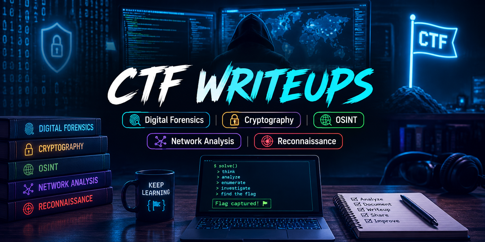

  

# CTF Writeups

Welcome to my CTF Writeups repository.

This repository contains detailed writeups of Capture The Flag (CTF) challenges that I solved while learning cybersecurity.

The goal of these writeups is educational. Every writeup explains the thought process, tools used, and methodology rather than simply presenting the final answer.

## 📑 Table of Contents

- [Categories](#-categories)
- [Tools Used](#-tools-used)
- [Writeups](#-writeups)
- [Disclaimer](#-disclaimer)

## 📚 Categories

- 🔍 [Digital Forensics](#-digital-forensics)
- 🌍 [OSINT](#-osint)
- 🔐 [Cryptography](#-cryptography)
- 🌐 [Network Analysis](#-network-analysis)
- 📡 [Reconnaissance](#-reconnaissance)
- 📦 [Miscellaneous](#-miscellaneous)

## 🛠 Tools Used

- Wireshark
- CyberChef
- ExifTool
- Binwalk
- Strings
- Nmap
- Searchsploit
- Linux
- Python
- Visual Studio Code

## 📂 Writeups
### 🔍 Digital Forensics
- 📄 [History Lesson](digital-forensics/history-lesson.md)

### 🌍 OSINT
- 📄 [The Reconquest Photograph](osint/the-reconquest-photograph.md)
- 📄 [City of the Hadith](osint/city-of-the-hadith.md)

### 🔐 Cryptography
- 📄 [Textbook Leak](cryptography/textbook-leak.md)

### 🌐 Network Analysis
- 📄 [Plaintext Catch](network-analysis/plaintext-catch.md)

### 📡 Reconnaissance
- 📄 [Legacy and Forgotten](reconnaissance/legacy-and-forgotten.md)

### 📦 Miscellaneous
- 📄 [Stringed Along](miscellaneous/stringed-along.md)

## 📜 Disclaimer

This repository contains CTF writeups created as part of my learning journey. All content is shared for educational purposes only.
