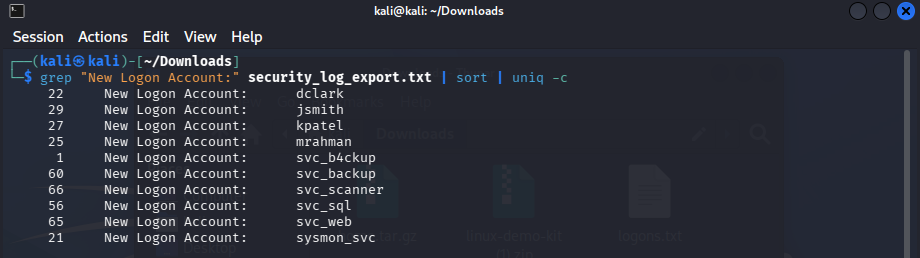
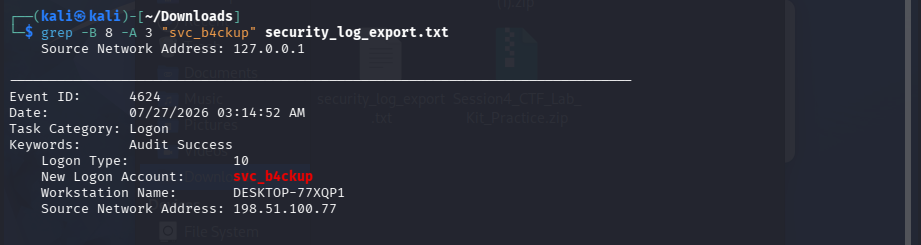

# First Login

## Table of contents

- [Challenge Description](#challenge-description)
- [Investigation](#investigation)
- [Tools Used](#tools-used)
- [Lessons Learned](#lessons-learned)

---

**Category:** Digital Forensics

## Challenge Description

A workstation's Security event log was exported after a suspected intrusion.
Most of the entries belonged to two employees performing their normal activities, but one logon was suspicious.
The goal was to identify that unusual login and construct the flag from the account name, logon type, and login time.

## Investigation

### 1. Exploring the Log File

I started by opening the security_log_export.txt file in Kali Linux.

At first, I tried several different commands and approaches to understand the structure of the large log file and find the relevant events.

Since this was a Windows Security Event Log export, I searched for successful logon events using Event ID 4624 and find 373 successful logon events.

Because the output was quite large, I initially tried several filtering and searching approaches to narrow down the suspicious login.

### 2. Understanding the Log Format

After inspecting the beginning of the log, I found that each event contained information such as:

`Event ID``Date`
`Logon Type`
`New Logon Account`
`Workstation Name`
`Source Network Address`

For example:

    Event ID:      4624
   
    Date:         07/27/2026 08:02:11 AM

    Task Category: Logon

    Keywords:      Audit Success

    Logon Type:            2
    
    New Logon Account:      jsmith

This helped me understand which fields were important for solving the challenge.

### 3. Looking for Unusual Accounts

The challenge mentioned that most logons belonged to two normal employees.

So instead of manually checking all 373 events, I counted how many times each account appeared:

    grep "New Logon Account:" security_log_export.txt | sort | uniq -c

The result included:

One account immediately stood out:

`svc_b4ckup`

It appeared only once, while the similarly named `svc_backup` appeared 60 times.

The unusual spelling also made `svc_b4ckup` suspicious.

### 4. Finding the Suspicious Event

I then searched for the complete event associated with this account:

    grep -B 8 -A 3 "svc_b4ckup" security_log_export.txt

The result was:

This was the suspicious logon.

## Tools Used
- Kali Linux
- Linux Terminal
- `grep`
- `sort`
- `uniq`

## Lessons Learned

This challenge reminded me that a large log file does not always need to be examined manually.

Initially, I tried several different commands and filtering approaches because the log contained hundreds of events. After understanding the log structure, counting the accounts helped me quickly identify the unusual account.

