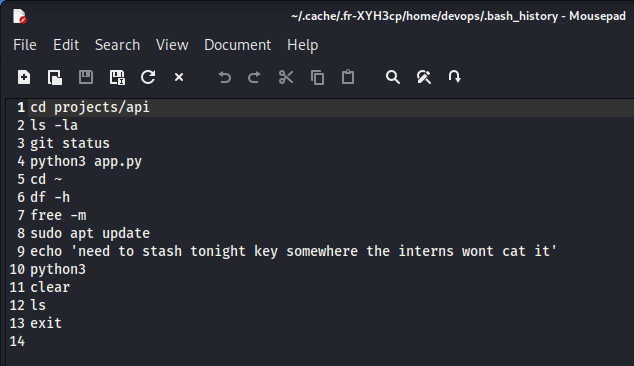
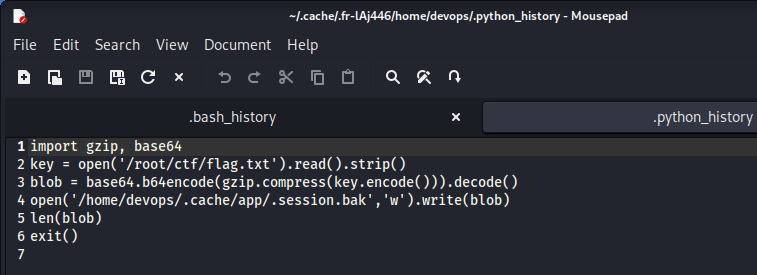
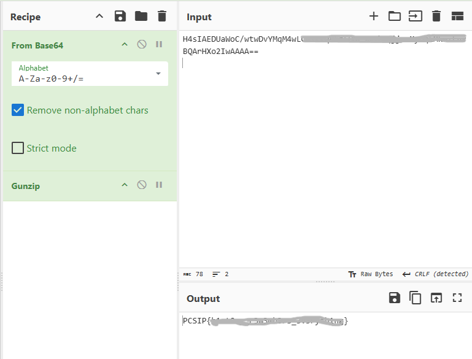

# History Lesson

## Table of contents

- [Overview](#overview)
- [Challenge Description](#challenge-description)
- [Investigation Process](#investigation-process)
- [Solution](#solution)
- [Lessons Learned](#lessons-learned)
- [Tools Used](#tools-used)

---
## Overview

**Category:** Digital Forensics

This challenge focuses on investigating a recovered Linux home directory to uncover a hidden secret. Instead of storing sensitive information directly, the user relied on encoding and compression while unintentionally leaving behind valuable forensic artifacts. The objective was to analyze those artifacts, reconstruct the user's actions, and recover the hidden flag.

## Challenge Description
The challenge provided a recovered home directory from a DevOps operator's Linux system. It contained several useful files and directories, such as the shell history, Python history, cache files, SSH configuration, and project-related files.

Although the secret was not stored directly in plain text, the user's daily activities left behind enough forensic evidence. By carefully examining these artifacts, it was possible to trace the user's actions and eventually recover the hidden flag.
## Investigation Process

### Step 1: Examining the Available Files

The recovered home directory contained several files and directories that could potentially reveal traces of the user's activity.

```
.cache/
.config/
.ssh/
projects/
.bash_history
.python_history
```

Since command history often provides valuable forensic evidence, I decided to begin the investigation by examining the Bash history file.

### Step 2: Inspecting the Bash History

I opened the `.bash_history` file using Visual Studio Code and reviewed the recorded commands.



Among the normal administrative commands, one particular entry immediately caught my attention:

```text
echo 'need to stash tonight key somewhere the interns wont cat it'
```

This message suggested that the user had intentionally hidden the secret somewhere on the system rather than storing it directly in a readable file.

Based on this clue, I concluded that the Bash history alone would not be enough, so I continued searching for other artifacts that might reveal how the secret was stored.

### Step 3: Inspecting the Python History

After reviewing the Bash history, I moved on to the `.python_history` file to see whether the user had previously executed any useful scripts.

While examining the file, I found the following Python code:



This snippet revealed the entire workflow used to hide the secret.

From the code, I learned that:

- The flag was read from `flag.txt`.
- It was compressed using **gzip**.
- The compressed data was encoded using **Base64**.
- Finally, the encoded data was written to:

```
/home/devops/.cache/app/.session.bak
```

At this point, I knew the next step was to inspect the `.session.bak` file and reverse the encoding process.

## Solution

### Step 4: Recovering the Hidden Data

I navigated to the `.cache/app/` directory and opened the `.session.bak` file using Visual Studio Code.

The file contained a single Base64-encoded string.

```text
H4sIAEDUaWoC/wtwDvYMqM4wLC4................BQArHXo2IwAAAA=
```

The Python history had already revealed the encoding process. To recover the original data, I reversed the same process using **CyberChef**.



After decoding the Base64 string and decompressing the Gzip data, the original flag was successfully recovered.

## Lessons Learned

This challenge demonstrates that sensitive information does not need to be stored in plain text to become recoverable.

During a forensic investigation, command history, interpreter history, cache directories, and temporary files can reveal valuable evidence about a user's activity.

It also highlights that Base64 encoding and Gzip compression are not security mechanisms. Anyone who discovers the encoded data and understands the process can easily recover the original information.
## Tools Used

- Visual Studio Code
- CyberChef

