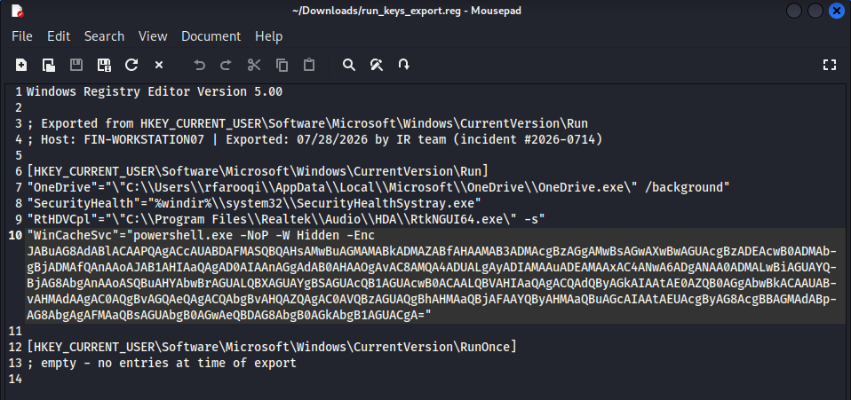
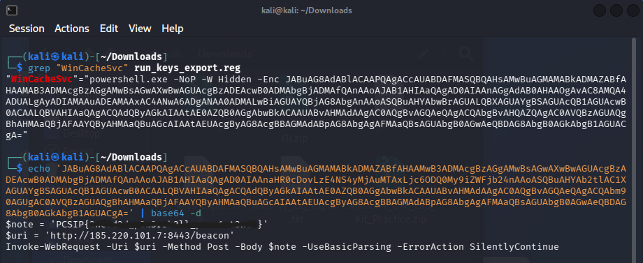

# Quiet Persistence

## Table of contents

- [Challenge Description](#challenge-description)
- [Investigation](#investigation)
- [Solution](#solution)
- [Lessons Learned](#lessons-learned)
- [Tools Used](#tools-used)

---

**Category:** Digital Forensics

## Challenge Description

This challenge provided a Windows Registry Run-key export from a workstation flagged for unusual beaconing activity. Among four entries, three appeared to be normal program paths, while one contained a hidden PowerShell command.

The goal was to identify the suspicious entry, decode the hidden command, and recover the flag.

## Investigation

I first examined the provided `run_keys_export.reg` file and looked at the entries under:

The first three entries appeared to be normal Windows or software startup programs.

However, `WinCacheSvc` looked suspicious because it was not a normal executable path. Instead, it contained:

      powershell.exe -NoP -W Hidden -Enc

The `-W Hidden` option indicated that the PowerShell window would be hidden, while `-Enc` indicated that the following command was encoded.

The long string after `-Enc` appeared to be Base64-encoded data.

I decided to decode the encoded command from the terminal instead of executing it. After decoding, the PowerShell script revealed.

The decoded script showed that the flag was stored inside the `$note` variable. It also attempted to send the value to a remote endpoint using an HTTP POST request.

## Solution

The suspicious Registry entry was `WinCacheSvc`.

It used a hidden PowerShell command with an encoded payload. After decoding the Base64 data, the flag was found directly in the `$note` variable.

## Lessons Learned

This challenge demonstrates how Windows Registry Run keys can be abused for persistence and how PowerShell commands can be hidden using Base64 encoding.

The combination of `-W Hidden` and `-Enc` was an important clue. Instead of executing the encoded command, decoding it directly allowed me to inspect the PowerShell script safely and recover the flag.

It also showed how a seemingly normal Registry entry can contain hidden behavior that is not immediately visible at a quick glance.

## Tools Used
- Kali Linux
- Linux Terminal
- Base64
