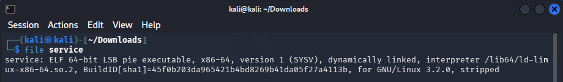
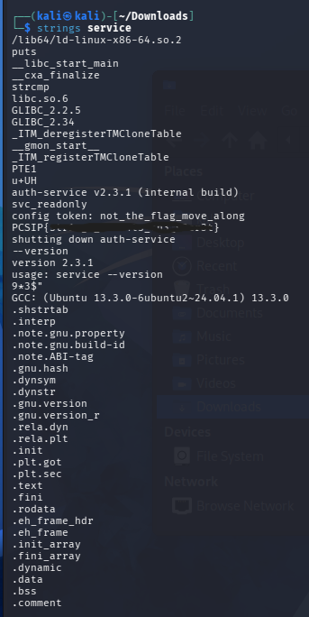

# Stringed Along

## Table of contents

- [Challenge Description](#challenge-description)
- [Investigation](#investigation)
- [Lessons Learned](#lessons-learned)
- [Tools Used](#tools-used)

---

**Category:** Miscellaneous

## Challenge Description

This challenge provided a binary file named `service`. The description mentioned that there was no need to execute or reverse engineer the binary. Instead, the goal was to inspect the printable strings stored inside the file.

## Investigation

I first read the challenge description carefully. The phrase:

> "You don't need to run it or reverse it — just look at what's printable inside."

immediately suggested using the `strings` utility.

To verify the file type, I used the `file` command.

The output confirmed that the file was an ELF executable.

Next, I extracted all printable strings from the binary.

Since the output contained many strings, I searched specifically for the expected flag format.

The flag appeared among the printable strings, so no reverse engineering or binary analysis was required.

## Lessons Learned

This challenge demonstrated that not every binary requires reverse engineering. Sometimes sensitive information is left inside the executable as printable strings, making simple command-line utilities like `strings` enough to recover useful data.

## Tools Used

- Linux Terminal
- `file`
- `strings`
- `grep`
