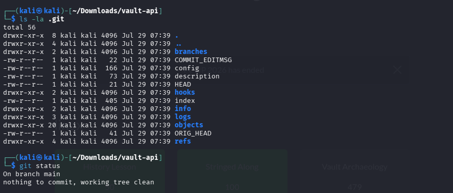
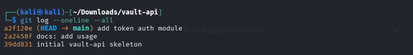
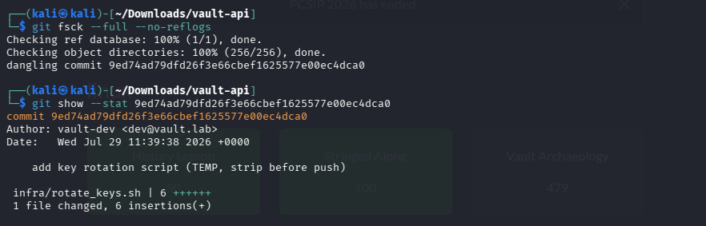
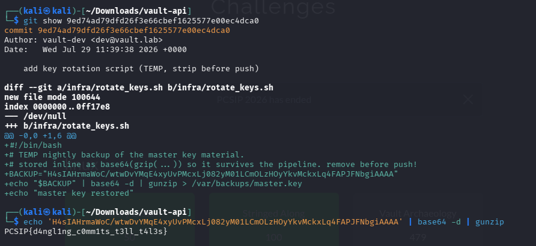

# Vault Archaeology

## Table of contents

* [Challenge Description](#challenge-description)
* [Investigation](#investigation)
* [Solution](#solution)
* [Lessons Learned](#lessons-learned)
* [Tools Used](#tools-used)

---

**Category:** Miscellaneous

## Challenge Description

A developer on the `vault-api` project committed something they shouldn't have, panicked, and cleaned it up before pushing. The current repository is spotless - `git log` shows nothing suspicious and the working tree is clean.

The goal was to recover what the developer tried to remove from the Git repository.

## Investigation

I first extracted the provided `vault-api.tar.gz` archive and opened the resulting repository.

I checked the `.git` directory to confirm that the Git metadata was still present.



I then checked the available commit history:



There was nothing suspicious in the normal Git history.

Since the challenge mentioned that the developer had cleaned up the branch, I suspected that the removed commit might still exist as an unreachable Git object.



I then inspected the dangling commit:



This recovered the hidden content containing the flag.

## Solution

The suspicious commit was not present in the normal branch history, but it remained in the Git object database as a dangling commit.

After inspecting the dangling commit, I recovered the temporary `rotate_keys.sh` script.

The script contained a Base64-encoded gzip payload. Following the decoding process shown in the script revealed the hidden flag.

## Lessons Learned

This challenge demonstrated that removing a commit from the visible branch history does not necessarily remove its underlying Git objects.

The important step was using:

```bash
git fsck --full --no-reflogs
```

to search for unreachable objects.

It also demonstrated the importance of checking old commits and understanding how encoded data can be recovered from files that were intended to be temporary.

A clean working tree and a normal `git log` do not always mean that sensitive data has been completely removed from a Git repository.

## Tools Used

* Kali Linux
* Git
* Linux Terminal
* Base64
* gzip
