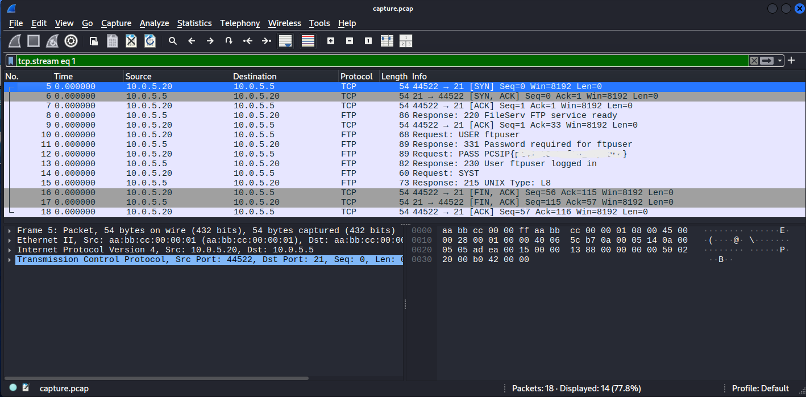

# Plaintext Catch

## Table of contents

- [Challenge Description](#challenge-description)
- [Investigation](#investigation)
- [Solution](#solution)
- [Lessons Learned](#lessons-learned)
- [Tools Used](#tools-used)

---

**Category:** Network Analysis

## Challenge Description

A network traffic capture (`capture.pcap`) was provided for analysis. The objective was to inspect the captured network traffic and identify sensitive information transmitted over an insecure protocol.

## Investigation

I opened the provided `capture.pcap` file using **Wireshark**.

After reviewing the packet list, I noticed that the capture contained multiple protocols. Since the challenge hinted that someone had logged into a service using plaintext communication, I focused on the **FTP** traffic.

Rather than inspecting every packet individually, I selected one of the FTP packets and used **Follow → TCP Stream** to reconstruct the entire conversation between the client and the server.

The TCP stream clearly showed the FTP authentication process, including the username and password transmitted in plaintext.

## Solution

The FTP session exposed the authentication credentials because FTP does not encrypt transmitted data.

The required flag was recovered directly from the plaintext password shown in the TCP stream.

## Lessons Learned

This challenge demonstrates why legacy plaintext protocols such as FTP should not be used for transmitting sensitive information. Anyone with access to captured network traffic can reconstruct the session and recover credentials without needing to break any encryption.

## Tools Used

- Wireshark
