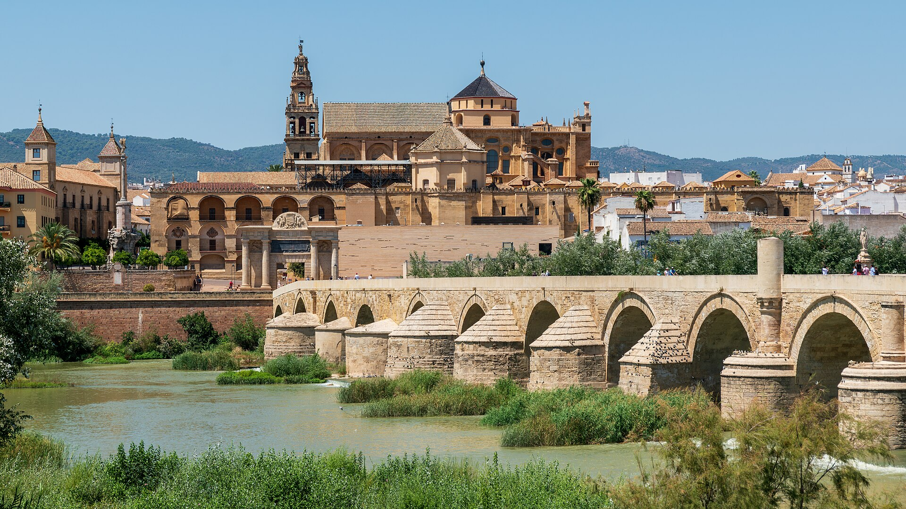
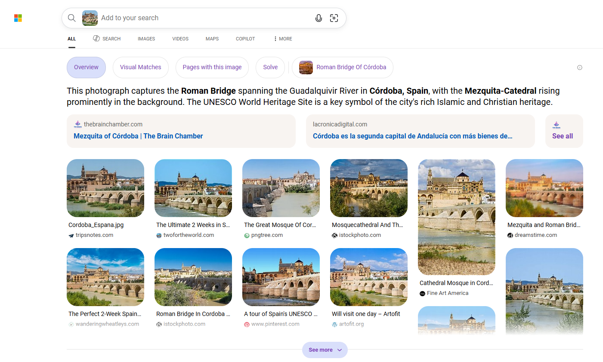

# The Reconquest Photograph

**Category:** OSINT

## Challenge Description

This challenge provided a photograph and a handwritten case file. The objective was to identify the location shown in the image and determine the historical event referenced in the note.

## Investigation

I first read the case file to understand the clues before examining the attached photograph.

The note provided several important hints:

- A king captured the city after a long siege.
- The surrender happened on a Catholic saint's feast day in early summer.
- A former mosque on the hill was reconsecrated shortly afterward.

Since the photograph was the primary clue, I uploaded it to **Bing Visual Search** to identify the location.

The visual search results suggested that the image was taken in **Córdoba, Spain**. I then compared the landmarks in the photograph with publicly available images. The skyline, the **Roman Bridge**, the **Guadalquivir River**, and the **Mosque–Cathedral of Córdoba (Mezquita-Catedral)** all matched the location.

After identifying the city, I searched for the historical event mentioned in the note. Historical references showed that **King Ferdinand III of Castile** captured Córdoba after a long siege.

Finally, I confirmed that the city's surrender took place on **30 July 1236**, matching the clues provided in the case file.

## Solution

After identifying both the city and the historical event, I constructed the flag using the required format and successfully solved the challenge.

## Lessons Learned

This challenge demonstrated how combining visual analysis with historical research can solve OSINT problems. Even when no city or year is explicitly provided, carefully interpreting contextual clues and verifying them with reliable historical sources can lead to the correct solution.

## Tools Used

- Bing Visual Search
- Google Search
- Web Browser
