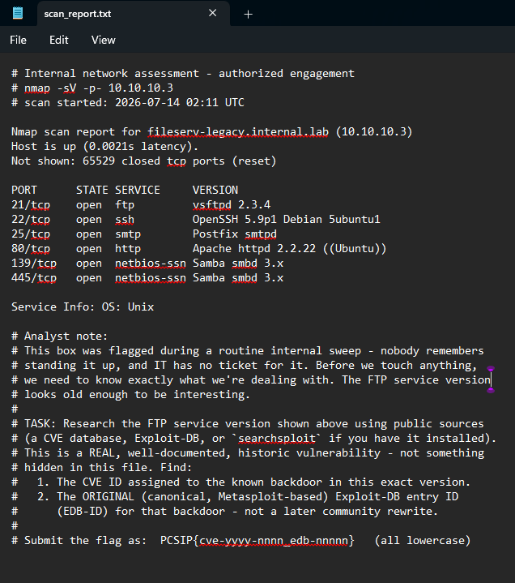
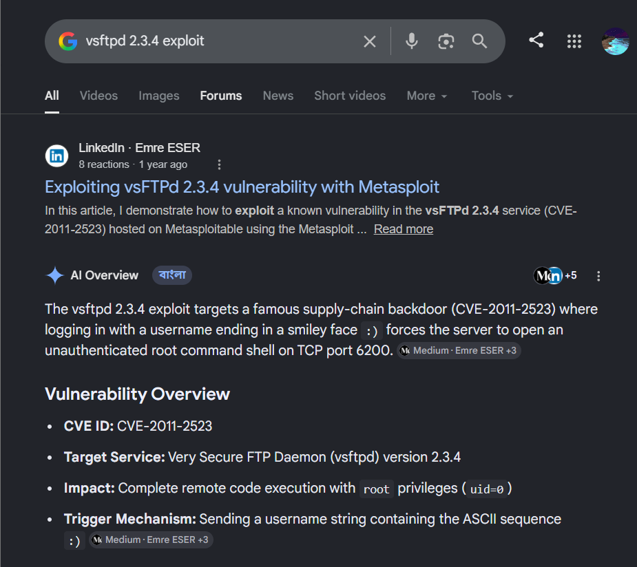

# Legacy and Forgotten

## Table of contents

- [Challenge Description](#challenge-description)
- [Investigation](#investigation)
- [Solution](#solution)
- [Lessons Learned](#lessons-learned)
- [Tools Used](#tools-used)

---

## Challenge Description

This challenge provided an Nmap service scan of a legacy server. The objective was to identify a known vulnerability associated with an outdated FTP service by researching publicly available security resources.

## Investigation

I first read the challenge description to understand the objective. After that, I examined the provided Nmap scan report.

### Nmap Scan



Among the listed services, the following entry immediately stood out:

```text
21/tcp open ftp vsftpd 2.3.4
```

Since the challenge specifically mentioned the old FTP service, I focused my investigation on the `vsftpd 2.3.4` version.

My first step was to search Google using the keyword:

### Google Search



The search results pointed to well-known security resources discussing a backdoor vulnerability in this version.

### Identifying the Vulnerability

After reviewing several search results, I found that multiple trusted security resources referenced the same vulnerability for **vsftpd 2.3.4**. Cross-checking the information confirmed that the affected version was associated with **CVE-2011-2523**.

I then searched for the original Exploit-DB entry related to this vulnerability. The Exploit-DB page provided the canonical exploit entry, which listed the **EDB-ID 17491**.

These two values matched the information requested in the challenge.

## Solution

Using the identified CVE ID and the original Exploit-DB entry ID, I constructed the flag according to the required format and successfully solved the challenge.

## Lessons Learned

This challenge highlighted the importance of service enumeration during reconnaissance. Identifying outdated software versions and researching public vulnerability databases can quickly reveal known security issues. It also reinforced the value of validating information across multiple trusted sources before drawing conclusions.

## Tools Used

- Google Search
- Nmap Scan Report
- Exploit-DB
- CVE Database
